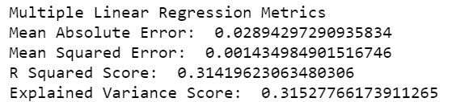

# Capstone Project - Sociodemographic Data and COVID-19 Vaccine Hesitancy in the US

## Team - Week 3 Roles
* **Square:** Finalize Machine Learning models (Tiffany)
* **Circle:** Finalize Dashboard (Hayden)
* **Triangle:** Finalize Presentation (Aarani)
* **X:** Peer review codes (Amy)

## Project Overview
**Topic:** An analysis of COVID-19 vaccine hesitancy.

**Topic selection rationale:** Given the global presence of COVID-19 and the implementation of recent months of vaccine rollout have been a positive change in Ontario, our team decided to look into vaccine hesitancy to understand this issue better.

**Data Description/Source:** Our team was able to secure a dataset from Kaggle that captures United States county-level data that includes sociodemographic data, geographic data and percentage of populations that are vaccine hesitant. The original dataset has 18 columns of sociodemographic and geographic indicators, and two columns for vaccine hesitancy outcomes. The dataset contains information from 3,142 counties in the United States. The data was obtained through Kaggle (https://www.kaggle.com/deepshah16/vaccine-hesitancy-for-covid19), and is sourced from https://www.data.gov.

**Questions:**
1. Based on the sociodemographic indicators available, are we able to predict vaccine hesitancy in US counties?
2. How do sociodemographic indicators affect vaccine hesitancy?
3. What barriers exist in vaccine implementation and how can these be mitigated?
4. How can this analysis inform vaccine implementation strategies within an Ontario context?

## Technology
**Data Cleaning and Analysis:** Python version 3.7.6 (Visual Studio Code and Jupyter Notebook) with Python Libraries used to clean data and perform exploratory analysis (Pandas, numpy, SQLAlchemy)

**Database Storage:** SQL (Postgres & pgAdmin) is the database we intend to use, and we plan to integrate Flask to display the data.

**Machine Learning:** SciKitLearn is the Machine Learning library we'll be using to create a Linear Regression model and a Random Forest Regression model. Additionally, regression metrics will be used from this library.

**Dashboard:** We created dashboards using Tableau Public to display data visualization. In addition, we plan to use a Flask template and integrate D3.js for a fully functioning and interactive dashboard. To host the web page, we will use HTML and CSS with embedded Tableau visualizations.

## Machine Learning Model & Preprocessing 
**Description of preliminary data preprocessing:** The [merged dataset](Resources/merged_Vaccine_Hesitancy.csv) was used for the [data preprocessing](preprocessing_dataset.ipynb) in preparation for the machine learning models. Unnecessary feature columns were dropped. Remaining feature columns only had 1 row found to have a null value which was filled with 0. The [clean dataset](Resources/vaccine_hesitancy_clean.csv) was then connected with the database. 

**Description of preliminary feature engineering and preliminary feature selection, including the decision-making process:** In the original dataset, two target outcomes were available: percent of population vaccine hesitant and percent of population strongly vaccine hesitant. Only one target outcome (y) was chosen, **percent vaccine hesitant**, as it is unclear how the data/survey distinguished the difference between estimated vaccine hesitancy and estimated strong vaccine hesitancy. In the decision-making process for features (X), all columns with irrelevant/redundant data was removed. For example, the 'svi_category'(object) was a redundant column as the 'social_vulnerability_index'(float64) was available to use as a feature to train and test the models. 

**Description of how data was split into training and testing sets:** For the multiple linear regression and random forest regression model, the training set used 70% of the data and the testing set used the remaining 30% of the data. This was done with the Sci-Kit Learn library train_test_split method. 

**Explanation of model choice, including limitations and benefits & changes in model choice:** We chose to use supervised machine learning models as the dataset has a continuous target outcome that could be used for the model predictions within the numeric range of 0-1. 
* **Linear regression** was the first model used to predict the potential effects of sociodemographic indicators on vaccine hesitancy. It is beneficial as it is a fast and efficient model for initial machine learning analysis. A simple [linear regression](linear_regression.ipynb) was used first to test if the data is linear or non-linear. The results of the linear regression model indicated a more complex model should be used as the predictions were not very close to the original targets. The major limitation of linear regression model is non-linear data. 
* **Multiple linear regression** was the next model used as we have multiple features (X) and one target (y). The benefits and limitations of this [linear model](multiple_linear_regression.ipynb) are similar with those of the linear regression. With multiple features, it is harder to visualize the dataset trends and therefore, heavily relies on the slope and y-intercept determined by the model. In this regression model, the data was split into the training and testing sets versus the simple linear regression model where all of the data was used for fitting and predicting the model. This ensures an extra method of validation and confidence on the regression model predictions.
* A **random forest regression** model was used to compare the efficiency and efficacy of the predictions to the linear regression model. The [random forest model](random_forest_regression.ipynb) will intake all feature columns to build several simple decision trees to predict the percent vaccine hesitancy. The random forest model is beneficial in this analysis as it can input multiple features in a fast and powerful algorithm which is not prone to overfitting. However, random forest is limited as all predictions are within the training set and it is unable to extrapolate values which are not within the dataset.

**Regression metrics:** 
* Mean Absolute Error (MAE) - the average measure of error between predicted and actual values 
* Mean Squared Error (MSE) - the average squared measure of error between predicted and actual values 
* R Squared Score - coefficient of determination; 'goodness of fit', measures how well the model can predict unseen values
* Explained Variance Score - proportional dispersion of data

Of the three machine learning models, the most successful model was the **Random Forest Regression**. This model produced the highest R squared scored indicating it has a higher "goodness of fit" and can better predict unseen data; making it the best model to use when predicting vaccine hesitancy in Ontario. The MAE and MSE for the random forest model is also the closest to 0, indicated the measure of error is lowest when compared to the linear regression models. 

-------------------------------------------------------------------------

-------------------------------------------------------------------------

-------------------------------------------------------------------------

-------------------------------------------------------------------------

## Database Integration

The database was integrated between Python and SQL in two ways:

* The datasets were loaded onto Python from a csv format, and then imported to SQL using SQLAlchemy after the dataset was cleaned
* The now merged datasets were then used to create the Dashboard images (Tableau)

The above integrations can be viewed [here](preprocessing_dataset.ipynb) are visible in the excerpt below:

## Dashboard
**Description of the tools used to create dashboard**:
We are using the Tableau to create powerful analytic dashboards and data visualizations for our vaccine hesitancy analysis project. Tableau is a popular tool used to handle big datasets and create interactive visualizations, it's also easy for a non-technical audience to understand our data story.

Included table of charts:
* State vs. % Estimated Hesitancy - heat mapping
* Social Vulnerability Index vs. % Estimated Hesitancy 
* Pie chart of different demographics

Draft Tableau Dashboards can be found [here](Vaccine_Hesitancy_Project.twbx).

**Description of interactive elements**:
In the dashboards, we plan to use interactive elements for US States, Category of SVI (Social Vulnerability Index), Level of Concern for Vaccine Rollout, to make the data visualizations that can be filtered or selected to show related table, charts and heat maps. We hope to display the data and our findings for an audience with a narrative.

**Showcasing dashboard in a webpage**:
There is potential to showcase the Tableau dashboard in the format of a webpage using one of the following options:
* Tableau embed method (embedding share code in an already created website to maintain the interactive portion of Tableau)
* Utilizing a Flask App through Python (to showcase images from the Tableau dashboard, however it will not maintain the interactive aspect)

## Presentation

**Our presentation contains:**
* An overview of our presentation, 
* Selected topic and rationale,
* Description of our data source,
* Questions we hope to answer with our dataset and analysis,
* Description of the data exploration of our project, including preprocessing our data,
* Data visualizations from Tableau, 
* Description of the data analysis we completed,
* Conclusions, lessons learned and next steps, and
* Technologies used throughout the project.

**Please see link to our Google slides presentation for more details:** https://docs.google.com/presentation/d/191P9TQXqxlFJWycma8cBj7R7hkfTKrkr5KptemuW2LQ/edit?usp=sharing
